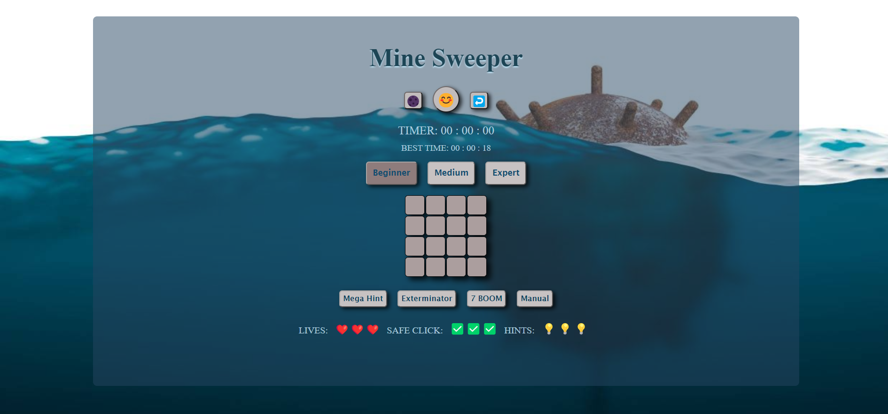

A Minesweeper game built in 4 days, using vanilla css. This is my first project in Coding Academy! [Check it out here](https://moriahamami.github.io/Mine-Sweeper/ "Website link")!

## Instructions
- Left click reveals the cell’s content.
- Right click flags/unflags a suspected cell (you cannot reveal a flagged cell).
- Game ends when:
o LOSE: when clicking a mine.

o WIN: all the mines are flagged, and all the other cells are shown.
- The game includes 3 levels:
o Beginner (4 * 4 with 2 mines)

o Medium (8 * 8 with 14 mines)

o Expert (12 * 12 with 32 mines)
- Expanding: When left clicking on cells there are 3 possible cases:
o Mine was clicked – reveals the mine clicked.
o Cell (without a mine) with neighbors – reveals the cell.
o Cell (without a mine) without neighbors – reveals the cell, all the empty neighboring cells, and their numbered neighbors using recursion.
- The first clicked cell is never a mine (mines are placed and neighbors are counted only after the first click).

## Special Features
- Timer - starts on the first click and stops when the game is over.
- Lives - The user has 3 lives. When a mine is clicked, there is an indication to the user that he clicked a mine and the lives counter decreases. 
-The Smiley - an inidcation of the game status:
o Normal 😃 

o Sad & Dead – LOSE 🤯 (stepped on a mine)

o Sunglasses – WIN 😎

o Clicking the smiley resets the game
- Hints - The user has 3 hints. Once a hint is selected, when an unrevealed cell is clicked, the cell and its neighbors are revealed for a second, and the selected hint disappears.
- Best Score - the best score is kept in the local storage (per level) and is shown on the page.
- Safe click - The user has 3 Safe-Clicks. Clicking the Safe-Click button will mark a random covered cell for a few seconds that is safe to click (does not contain a mine). The remaining Safe-Clicks count is presented.
- Manually positioned mines - a “manually create” mode in which the user first positions the mines (by clicking cells) and then plays.
- 7 BOOM! - a game mode where the game restarts and locates the mines according to the “7 BOOM” principles (each cell-index that contains “7” or a multiplication of “7” has a mine). 
- Dark mode  
- Mega-Hint - works only once every game. It is used to reveal a whole area of the board for 2 seconds by clicking the area’s top-left cell and then the bottom-right cell.
- Mine Exterminator - Clicking the “Exterminator” button, eliminate 3 of the existing mines, randomly. The deleted mines are marked for 2-3 seconds. 
